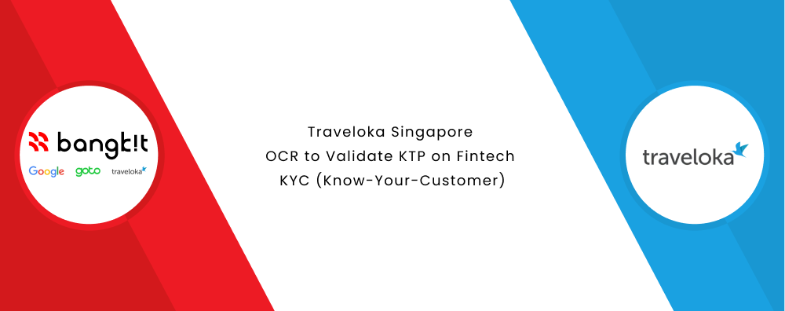

### Hey, this is us 👋

We're a team consist of 9 peoples at Bangkit Academy led by Google, Tokopedia, Gojek, & Traveloka. We're in collaboration with Traveloka Singapore creating a prototype with a theme of OCR to Validate KTP on Fintech - KYC (Know-Your-Customer).

### Our Teams 👦👧

Our team consists of 3 divisions, and each division has its own task. Machine Learning division which makes Machine Learning Model and algorithms to classify Indonesian ID Card and extract the data (Optical Character Recognition) contained in them. Cloud Computing division which designs Cloud Architectures for Applications and builds REST APIs for data and connects Machine Learning Models with Mobile Applications. Mobile Development division which creates User Interface designs and builds Android Applications to display OCR prototypes.

| Member | Student ID | Learning Path | University | Social Media |
| ----- | ----- | ----- | ----- | ----- |
| Ivan Muhammad Nizar | M7004F0304 | Machine Learning | Institut Teknologi Sepuluh Nopember | [LinkedIn](https://www.linkedin.com/in/ivanmuhammadn/) |
| Riza Isna Khoirun Nisa | M2015F1409 | Machine Learning | Universitas Negeri Yogyakarta | [LinkedIn](https://www.linkedin.com/in/rizaisnakhoir/) |
| Bryan Laurentio Anggoro | M2004F0167 | Machine Learning | Institut Teknologi Sepuluh Nopember | [LinkedIn](https://www.linkedin.com/in/bryanlaurentio/) |
| Bayu Eka Prawira | C2004F0300 | Cloud Computing | Institut Teknologi Sepuluh Nopember | [LinkedIn](https://www.linkedin.com/in/bayuekaprawira/) |
| Mochammad Arya Salsabila | C7296F2513 | Cloud Computing | Universitas Pembangunan Nasional Veteran Jawa Timur | [LinkedIn](https://www.linkedin.com/in/mochammad-arya-salsabila/) |
| Ariasatya Mahatma | C7004F0171 | Cloud Computing | Institut Teknologi Sepuluh Nopember | [LinkedIn](linkedin.com/in/ariasatya/) |
| Aimar Wibowo | A2004F0298 | Mobile Development | Institut Teknologi Sepuluh Nopember | [LinkedIn](https://www.linkedin.com/in/aimar-wibowo-739a7420b/) |
| Prasetya Naufal Rahmandita | A2006F0516 | Mobile Development | Universitas Brawijaya | [LinkedIn](http://www.linkedin.com/in/prasetya-naufal-54b352228) |
| Rizky Nuansa Nanda Permana | A7006F0643 | Mobile Development | Universitas Brawijaya | [LinkedIn](https://www.linkedin.com/in/rizkynuansa/) |

### Repository 📚

**Machine Learning**

[ML-C22-KY04](https://github.com/C22-KY04/ml-c22-ky04). Notebooks of our research and modelling for ID Card classification and algorithms for Optical Character Recognition.

**Cloud Computing**

[CC-C22-KY04](https://github.com/C22-KY04/cc-c22-ky04). Cloud Architecture diagram, ID Cards API built with Express, and Optical Character Recognition API built with Flask.

**Mobile Development**

[MD-C22-KY04](https://github.com/C22-KY04/md-c22-ky04). Login-Register App with OCR feature based on Android Platform with Kotlin.
